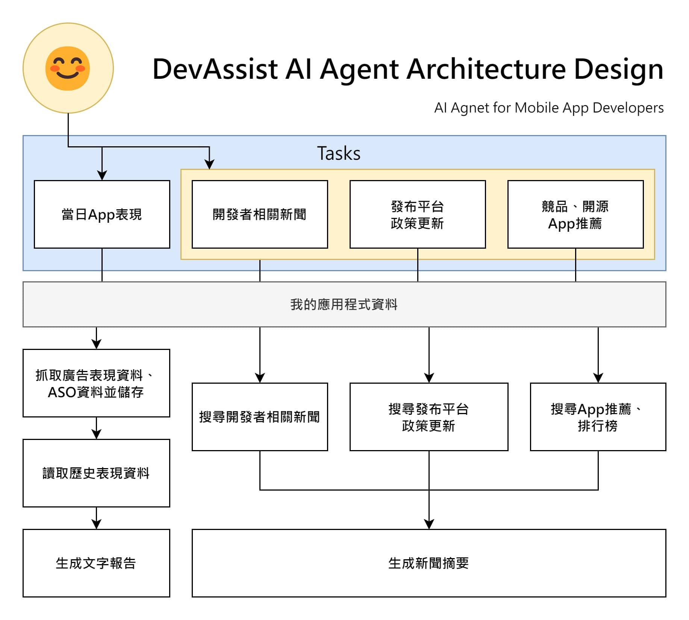

# Data Structure
1132 資料結構

## HW1

[▶️ dataAgent.py](./tests/autogen/dataAgent.py)

## HW2 - Questions Review Bot (0414更新

[▶️ Qreview.py](./tests/autogen/DRai/Qreview.py)

## DevAssist

DevAssist AI Agent, designed for app developers or publishers. It helps you monetize your app by analyzing data, ad revenue, and subscriptions.

*🔼 Dev AI Agent Architecture Design* [Learn More](https://samko5sam.github.io/data-structure-class/DevAssist.html)
