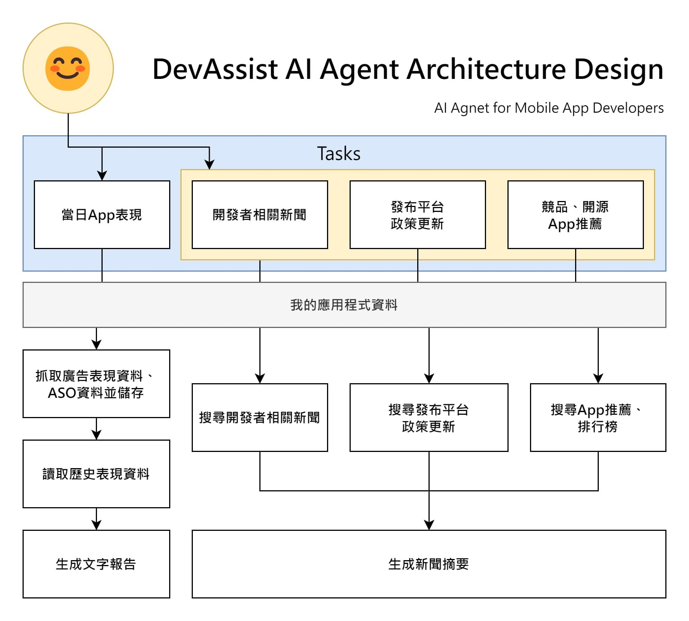

<!--
_paginate: false
-->

# Dev Assist
### AI Agent designed for app developers and publishers.

---

# 專案簡介

- 專案名稱：**DevAssist AI Agent**
- 目標：為App開發者設計一個AI Agent，協助完成App開發相關維護工作，提升管理效率。
- 核心功能：
  - 開發者相關新聞
  - 發佈平台政策更新
  - 熱門、開源App推薦
  - App、廣告數據分析
- 適用對象：行動應用程式開發者（特別是獨立開發者或小型團隊）

---

# 架構設計概覽

---

# 架構設計說明

- 任務層（Tasks）：
  - 自動App架構：生成App架構設計。
  - 簡易查詢相關新聞：提供與App開發相關的最新資訊。
  - 發佈平台政策更新：追蹤App Store、Google Play等平台的政策變化。
  - 熱門、開源App推薦：推薦熱門或開源App作為參考。

---

# 架構設計說明
- 資料來源（我的應用程式資料庫）：
  - 觀察中的App中繼資料。
  - App歷史排名資料（App趨勢）。
  - 已生成的新聞摘要：整理新聞與政策更新。
  - 廣告數據。
- 資料處理與輸出：
  - 開發者相關新聞。
  - 發佈平台政策更新。
  - 提供App推薦、排行榜。
  - 廣告數據分析。

---

# 時程安排

- 階段 1：需求分析與資料收集（第1-2週）
  - 收集行動應用程式開發者的需求（例如：需要哪些類型的資訊？）。
  - 建立「我的應用程式資料庫」，包含新取當季現資料與歷史共現資料。
  - 確認資料來源（如ASO工具、開源App資料庫、新聞API等）。
- 階段 2：AI模型設計與開發（第3-6週）
  - 開發自動App架構生成模組，基於歷史資料與開發者輸入生成架構。
  - 設計新聞查詢與政策更新模組，整合外部API（如新聞API、平台公告）。
  - 建立推薦系統，根據熱門與開源App資料提供建議。

---

# 時程安排

- 階段 3：測試與優化（第7-8週）
  - 進行內部測試，驗證AI Agent的任務執行效果（例如：架構生成是否合理？新聞查詢是否準確？）。
  - 收集早期使用者的反饋，優化模型與資料處理流程。
  - 調整生成文字報告與新聞簡報的格式，提升可讀性。
- 階段 4：部署與推廣（第9-10週）
  - 部署DevAssist AI Agent，開放給行動應用程式開發者使用。
  - 製作使用指南與教學影片，幫助開發者快速上手。
  - 推廣專案，透過開發者社群（如GitHub、Reddit）與技術論壇宣傳。

---

# 技術選擇

- AI Agent框架：使用smolagents框架
- AI模型：使用Gemini處理新聞與政策文字整理。
- 資料儲存：用yaml檔案儲存App資料與Json檔案儲存歷史資料。
- API整合：App排名爬蟲、Admob及Adsense資料API。

---

# 挑戰與解決方案

- 挑戰：新聞與政策更新不夠即時。
  - 解決方案：自建資料庫以確保資料更新與品質。
- 挑戰：每次進行新聞整理品質差異大。
  - 解決方案：持續改進Prompt品質，並使用先進的大語言模型。
